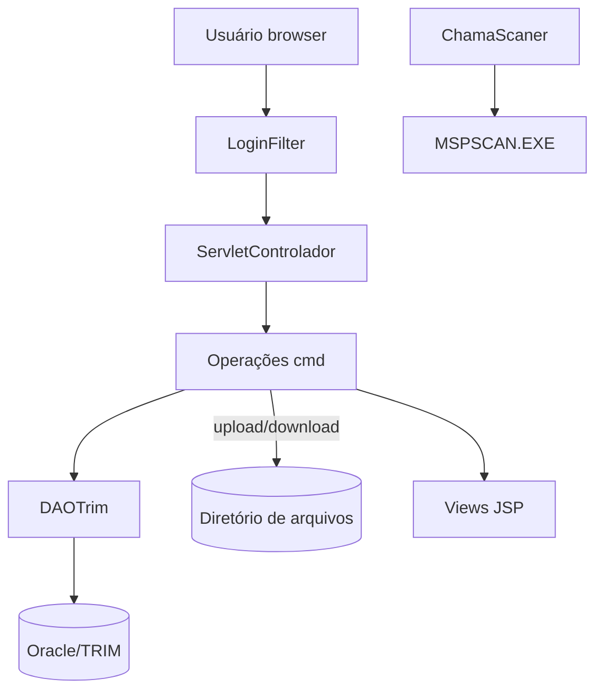
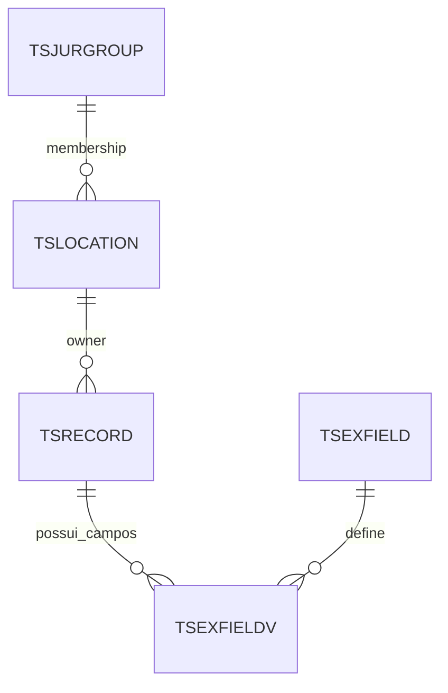

# Relatório de Engenharia Reversa do SisImagem

## Nível 1 - Executive Summary
- **Propósito:** Aplicação web de protocolo e gestão de documentos (PAPEM-41/42), permitindo login, pesquisa, inclusão, digitalização e download de registros armazenados em Oracle/TRIM e em diretório de arquivos do servidor.
- **Tecnologias:** Java 8 (Servlet/JSP), SLF4J com Log4j, upload via Apache Commons FileUpload, JDBC Oracle, jQuery 1.4.x no front-end.
- **Integrações externas:** Banco Oracle/TRIM via driver `oracle.jdbc.driver.OracleDriver`; armazenamento de arquivos em caminho configurado (`context-param path`); cabeçalho HTTP que chama aplicativo de scanner local (`MSPSCAN.EXE`).

## Nível 2 - Arquitetura

**Fluxo principal:**
1. Usuário acessa `login.jsp`; autenticação é processada por `ServletControlador` com `cmd=login` e `OperacaoLogin` valida credenciais no Oracle/TRIM.
2. Após login, filtros (`LoginFilter`) protegem páginas em `/views/*` e as operações subsequentes são despachadas conforme `cmd` (ex.: incluirDocumento, pesquisarDocumento, incluirUsuario).
3. Operações de documentos gravam metadados no Oracle/TRIM via `DAOTrim` e gravam o arquivo físico no diretório configurado; downloads usam `OperacaoAbrirDocumento`.
4. Para digitalização, `ChamaScaner` responde com cabeçalho apontando para aplicativo cliente.

**Dependências críticas:**
- Driver Oracle e string de conexão com placeholders de ambiente.
- Diretório de arquivos acessível pelo servidor de aplicação.
- Servlet mappings definidos em `web.xml` (páginas JSP, filtros, scanners).

## Nível 3 - Módulos/Componentes
### ServletControlador
- **Responsabilidade:** Front-controller que registra mapa de comandos (`cmd`) para instâncias de `Operacao` e realiza dispatch/forward para JSP.
- **Inputs/Outputs:** Recebe `HttpServletRequest` com parâmetro `cmd`; encaminha para operação e encaminha `RequestDispatcher` para JSP de destino.
- **Dependências:** Instâncias de `Operacao*`; `RequestDispatcher`; logging SLF4J.
- **Débitos técnicos:** Não usa generics no `HashMap`; validação de sessão manual em cada chamada; ausência de tratamento mais granular de erros.

### Operações de Documento (ex.: `OperacaoIncluirDocumento`)
- **Responsabilidade:** Processa formulários multipart, grava arquivo físico no caminho do contexto e persiste metadados via `DAOTrim`.
- **Inputs/Outputs:** Recebe campos de formulário e anexos; produz mensagens e atributos de sessão; insere registro em Oracle/TRIM.
- **Dependências:** `ServletFileUpload`, `Utilitaria` para nomes de arquivo, `DAOTrim` para persistência, caminho `context-param path`.
- **Débitos técnicos:** Uso extensivo de `System.out` e `log.debug` misturados; falta de validação de MIME/antivírus; possíveis sobrescritas de arquivo ao usar nomes originais.

### Operações de Usuário (ex.: `OperacaoLogin`)
- **Responsabilidade:** Autentica usuário, grava atributos na sessão, força troca de senha padrão e atualiza último acesso.
- **Inputs/Outputs:** Recebe parâmetros `usuario` e `senha`; grava `Usuario` na sessão; define página seguinte.
- **Dependências:** `DAOTrim.validaUsuarioSenha`, hash Whirlpool para senha; sessão HTTP.
- **Débitos técnicos:** Senha padrão hardcoded para redirecionar troca; contagem de tentativas armazenada na sessão sem expiração.

### DAOTrim
- **Responsabilidade:** Camada de acesso a dados para Oracle/TRIM (autenticação, geração de `recordId`, CRUD de documento/anexos/usuários).
- **Inputs/Outputs:** Recebe beans (`Documento`, `Usuario`, `Anexo`), strings SQL e conexões JDBC; retorna beans populados e flags de sucesso.
- **Dependências:** Driver `oracle.jdbc.driver.OracleDriver`; conexões configuradas com placeholders de ambiente; tabelas TRIM (`tsrecord`, `tsexfield`, `tsjurgroup`, `tslocation`, etc.).
- **Débitos técnicos:** Concatenação de parâmetros em SQL (risco de injection), conexões singleton na instância com `conn` compartilhado, credenciais hardcoded, ausência de pooling e fechamento seguro.

### Infra/Utilitários
- **LoginFilter:** Bloqueia acesso sem sessão de usuário; encaminha para `erro.jsp`.
- **Whirlpool:** Implementa hash de senha Whirlpool no lado do aplicativo.
- **ChamaScaner:** Define header apontando para `MSPSCAN.EXE` para acionar scanner local.

## Nível 4 - Banco de Dados

- **Tabelas principais inferidas:**
  - `TSRECORD`: armazena metadados de documentos (campos como `recordId`, `rccontaineruri`, datas).
  - `TSEXFIELD`/`TSEXFIELDV`: estrutura e valores de campos estendidos ligados a cada `TSRECORD`.
  - `TSLOCATION`: usuários/autores com senhas e grupos; usado para autenticação e bloqueio.
  - `TSJURGROUP`: grupos/perfis de acesso.
- **Relacionamentos-chave:** `TSRECORD` associa campos em `TSEXFIELDV` pelo `evobjecturi`; usuários em `TSLOCATION` pertencem a grupos de `TSJURGROUP` e são referenciados como responsáveis.

## Nível 5 - Riscos e Recomendações
- **Segurança:** Strings SQL concatenadas e sem parâmetros (SQL Injection); credenciais e hosts hardcoded no `DAOTrim`; ausência de HTTPS obrigatório em `web.xml`; upload sem validação de tipo/tamanho.
- **Disponibilidade:** Uso de conexão JDBC global sem pool pode esgotar conexões ou causar corridas; método `destroy` não garante fechamento em exceções.
- **Manutenibilidade:** Código mistura `System.out` com logs; ausência de testes automatizados; `HashMap` sem generics e sem enum para comandos.
- **Recomendações imediatas:** Externalizar configuração sensível (datasource/JNDI); parametrizar queries com `PreparedStatement`; validar uploads (MIME, tamanho, nome único); aplicar `transport-guarantee` CONFIDENTIAL no `web.xml` e usar filtros padronizados de autenticação.

## TODOs
- Confirmar schema real no Oracle/TRIM para gerar ER completo e normalizado.
- Mapear todas as páginas JSP e fluxos de navegação detalhados.
- Revisar integração com aplicativo de scanner e dependências de workstation.
