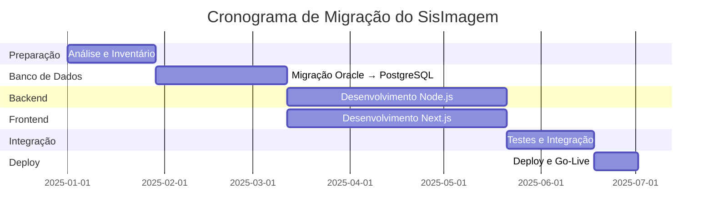

# Documentação de Migração do SisImagem

## 📋 Índice de Documentos de Migração

Esta pasta contém a documentação técnica necessária para migrar o SisImagem de tecnologias legadas (Java/Oracle) para tecnologias modernas (Node.js/PostgreSQL). Eu uso este índice para navegar pelos materiais de migração.

---

## 📚 Documentos Disponíveis

### 1. [Comparativo Técnico Detalhado](../02-planejamento-migracao/comparativo-tecnologias-detalhado.md)

**Descrição**: Análise técnica aprofundada comparando tecnologias para migração.

**Conteúdo:**
- ✅ Migração Oracle → PostgreSQL (detalhada)
- ✅ Comparativo Node.js vs PHP vs Java
- ✅ Comparativo de ORMs (Prisma vs TypeORM vs Sequelize)
- ✅ Comparativo de Frameworks Frontend
- ✅ Cronograma de migração (36 semanas)

**Quando ler**: Antes de tomar decisões sobre stack tecnológica

---

### 2. [Plano de Migração Oracle → PostgreSQL](./plano-migracao-oracle-postgresql.md)

**Descrição**: Plano detalhado e prático para migração do banco de dados.

**Conteúdo:**
- ✅ 6 fases de migração (6 semanas)
- ✅ Scripts SQL prontos para usar
- ✅ Checklist completo
- ✅ Estratégias de migração (completa vs incremental)
- ✅ Validação de dados
- ✅ Plano de rollback
- ✅ Monitoramento pós-migração

**Quando ler**: Ao planejar a migração de banco de dados

---

## 🎯 Decisões Chave

### Stack Recomendada

**Backend:**
- Node.js 20 LTS
- Express.js ou Fastify
- TypeScript 5.x
- Prisma ORM 5.x
- PostgreSQL 15

**Frontend:**
- Next.js 14
- TypeScript 5.x
- Tailwind CSS + shadcn/ui
- React Query + Zustand

**Justificativa:**
- 🚀 Performance superior
- 🔒 Segurança moderna
- 📱 Interface responsiva
- 🌐 Sem vendor lock-in

---

## 📅 Cronograma Geral

### Migração Completa: 36 semanas (~9 meses)

**Fases:**
1. **Preparação** (4 semanas)
2. **Migração de Banco** (6 semanas) ← CRÍTICO
3. **Backend** (10 semanas)
4. **Frontend** (10 semanas)
5. **Integração** (4 semanas)
6. **Deploy** (2 semanas)

---

## ⚠️ Riscos Principais

| Risco | Probabilidade | Impacto | Mitigação |
|-------|---------------|---------|-----------|
| Perda de dados na migração | Baixa | Crítico | Backup completo + validação rigorosa |
| Incompatibilidades Oracle/PostgreSQL | Alta | Alto | Testes extensivos + reescrita de queries |
| Performance inferior | Média | Alto | Tuning + índices + cache |
| Downtime prolongado | Média | Alto | Migração incremental + rollback plan |
| Bugs em produção | Média | Alto | Testes E2E + monitoramento |

---

## 🚀 Próximos Passos

### Imediatos (Semana 1-2)

1. **Revisar comparativos técnicos**
   - Revisar [comparativo técnico](../02-planejamento-migracao/comparativo-tecnologias-detalhado.md)
   - Definir critérios de decisão
   - Decisão: Node.js + PostgreSQL

2. **Obter Acesso ao Oracle**
   - Credenciais de produção (read-only)
   - Credenciais de homologação (read-write)

### Curto Prazo (Semana 3-6)

5. **Iniciar Fase 1: Análise**
   - Extração do schema Oracle
   - Análise de compatibilidade
   - Inventário completo

6. **Setup de Ambientes**
   - Ambiente de desenvolvimento
   - Ambiente de staging
   - Ambiente de produção (preparação)

### Médio Prazo (Semana 7-18)

7. **Migração de Banco de Dados**
   - Seguir [plano de migração](./plano-migracao-oracle-postgresql.md)
   - Validação rigorosa
   - Testes de performance

8. **Desenvolvimento Backend**
   - APIs REST
   - Autenticação/Autorização
   - Lógica de negócio

9. **Desenvolvimento Frontend**
   - Interface moderna
   - Responsividade
   - UX aprimorada

---

## ✅ Checklist de decisões de migração

- [ ] Definir critérios de comparação (segurança, manutenção, custo operacional, equipe disponível).
- [ ] Comparar opções de backend, frontend e banco.
- [ ] Validar compatibilidade de queries Oracle → alternativa escolhida.
- [ ] Definir estratégia de migração (incremental ou completa).
- [ ] Documentar decisões e pendências.

---

## 📖 Como Uso Esta Documentação

1. Leio o comparativo técnico antes de consolidar decisões de stack.
2. Uso o plano de migração como checklist quando eu estiver executando a mudança do banco.
3. Consulto o cronograma quando preciso revisar prazos e dependências.

---

## 🔗 Links Úteis

### Documentação do Sistema Atual

- [SYSTEM_OVERVIEW.md](../../SYSTEM_OVERVIEW.md)
- [reverse-engineering-report.md](../01-analise-sistema-atual/reverse-engineering-report.md)
- [guia-documentacao-sisimagem.md](../01-analise-sistema-atual/guia-documentacao-sisimagem.md)

### Análise de Gaps

- [gaps-documentacao-migracao.md](../01-analise-sistema-atual/gaps-documentacao-migracao.md)
- [plano-acao-documentacao.md](../02-planejamento-migracao/plano-acao-documentacao.md)

### Documentação Técnica

- [PostgreSQL Documentation](https://www.postgresql.org/docs/15/)
- [Node.js Documentation](https://nodejs.org/docs/latest-v20.x/api/)
- [Next.js Documentation](https://nextjs.org/docs)
- [Prisma Documentation](https://www.prisma.io/docs)
- [TypeScript Documentation](https://www.typescriptlang.org/docs/)

### Ferramentas

- [ora2pg](https://ora2pg.darold.net/)
- [pgloader](https://pgloader.io/)
- [PostgreSQL Migration Tools](https://wiki.postgresql.org/wiki/Converting_from_other_Databases_to_PostgreSQL)

---

## 📞 Suporte

Para dúvidas sobre a migração:
- **Documentação**: [docs/03-migracao-banco-dados/](./)
- **Código**: [src/](../../src)

---

## 📝 Histórico de Versões

| Versão | Data | Descrição |
|--------|------|-----------|
| 1.0 | 2025-12-19 | Documentação inicial de migração |
| 1.1 | - | (Planejado) Atualização pós-análise Oracle |
| 2.0 | - | (Planejado) Atualização pós-migração de banco |

---

**Última atualização**: 2026-01-02
