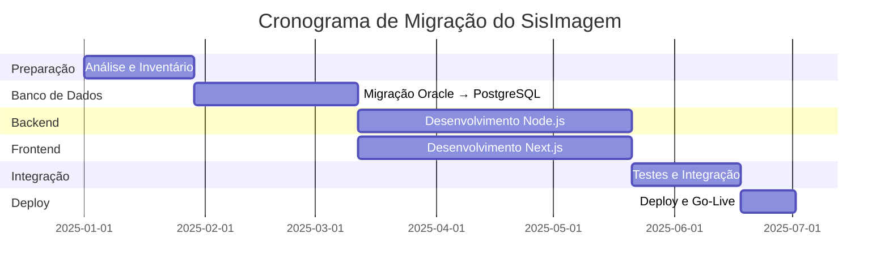

# Documentação de Migração do SisImagem

## 📋 Índice de Documentos de Migração

Esta pasta contém toda a documentação técnica necessária para migrar o SisImagem de tecnologias legadas (Java/Oracle) para tecnologias modernas (Node.js/PostgreSQL).

---

## 📚 Documentos Disponíveis

### 1. [Comparativo Técnico Detalhado](file:///home/bruna/sisimagem/docs/migracao/comparativo-tecnologias-detalhado.md)

**Descrição**: Análise técnica aprofundada comparando tecnologias para migração.

**Conteúdo:**
- ✅ Migração Oracle → PostgreSQL (detalhada)
- ✅ Comparativo Node.js vs PHP vs Java
- ✅ Comparativo de ORMs (Prisma vs TypeORM vs Sequelize)
- ✅ Comparativo de Frameworks Frontend
- ✅ Análise de custos (5 anos)
- ✅ Cronograma de migração (36 semanas)

**Quando ler**: Antes de tomar decisões sobre stack tecnológica

---

### 2. [Plano de Migração Oracle → PostgreSQL](file:///home/bruna/sisimagem/docs/migracao/plano-migracao-oracle-postgresql.md)

**Descrição**: Plano detalhado e prático para migração do banco de dados.

**Conteúdo:**
- ✅ 6 fases de migração (6 semanas)
- ✅ Scripts SQL prontos para usar
- ✅ Checklist completo
- ✅ Estratégias de migração (completa vs incremental)
- ✅ Validação de dados
- ✅ Plano de rollback
- ✅ Monitoramento pós-migração

**Quando ler**: Ao planejar a migração de banco de dados

---

## 🎯 Decisões Chave

### Stack Recomendada

**Backend:**
- Node.js 20 LTS
- Express.js ou Fastify
- TypeScript 5.x
- Prisma ORM 5.x
- PostgreSQL 15

**Frontend:**
- Next.js 14
- TypeScript 5.x
- Tailwind CSS + shadcn/ui
- React Query + Zustand

**Justificativa:**
- 🚀 Performance superior
- 🔒 Segurança moderna
- 📱 Interface responsiva
- 🌐 Sem vendor lock-in

---

## 📊 Resumo de Custos

### Comparação: Oracle vs PostgreSQL (5 anos)

| Item | Oracle + Java | PostgreSQL + Node.js | Economia |
|------|---------------|----------------------|----------|
| Licenças de BD | R$ 199.500 | R$ 0 | R$ 199.500 |
| Servidor de Aplicação | R$ 50.000 | R$ 0 | R$ 50.000 |
| Desenvolvimento | R$ 550.000 | R$ 450.000 | R$ 100.000 |
| Infraestrutura | R$ 80.000 | R$ 60.000 | R$ 20.000 |
| Treinamento | R$ 30.000 | R$ 20.000 | R$ 10.000 |
| Manutenção | R$ 150.000 | R$ 100.000 | R$ 50.000 |
| **TOTAL** | **R$ 1.059.500** | **R$ 630.000** | **R$ 429.500** |

**💰 Economia Total: 40.5%**

---

## 📅 Cronograma Geral

### Migração Completa: 36 semanas (~9 meses)

**Fases:**
1. **Preparação** (4 semanas)
2. **Migração de Banco** (6 semanas) ← CRÍTICO
3. **Backend** (10 semanas)
4. **Frontend** (10 semanas)
5. **Integração** (4 semanas)
6. **Deploy** (2 semanas)

---

## ⚠️ Riscos Principais

| Risco | Probabilidade | Impacto | Mitigação |
|-------|---------------|---------|-----------|
| Perda de dados na migração | Baixa | Crítico | Backup completo + validação rigorosa |
| Incompatibilidades Oracle/PostgreSQL | Alta | Alto | Testes extensivos + reescrita de queries |
| Performance inferior | Média | Alto | Tuning + índices + cache |
| Downtime prolongado | Média | Alto | Migração incremental + rollback plan |
| Bugs em produção | Média | Alto | Testes E2E + monitoramento |

---

## 🚀 Próximos Passos

### Imediatos (Semana 1-2)

1. **Aprovar Stack Tecnológica**
   - Revisar [comparativo técnico](file:///home/bruna/sisimagem/docs/migracao/comparativo-tecnologias-detalhado.md)
   - Decisão: Node.js + PostgreSQL

2. **Aprovar Orçamento**
   - Migração de banco: R$ 91.200
   - Desenvolvimento total: R$ 630.000 (5 anos)

3. **Montar Equipe**
   - 1 Tech Lead Full-stack
   - 2 Desenvolvedores Full-stack Sênior
   - 1 Desenvolvedor Frontend
   - 0.5 DevOps/SysAdmin

4. **Obter Acesso ao Oracle**
   - Credenciais de produção (read-only)
   - Credenciais de homologação (read-write)

### Curto Prazo (Semana 3-6)

5. **Iniciar Fase 1: Análise**
   - Extração do schema Oracle
   - Análise de compatibilidade
   - Inventário completo

6. **Setup de Ambientes**
   - Ambiente de desenvolvimento
   - Ambiente de staging
   - Ambiente de produção (preparação)

### Médio Prazo (Semana 7-18)

7. **Migração de Banco de Dados**
   - Seguir [plano de migração](file:///home/bruna/sisimagem/docs/migracao/plano-migracao-oracle-postgresql.md)
   - Validação rigorosa
   - Testes de performance

8. **Desenvolvimento Backend**
   - APIs REST
   - Autenticação/Autorização
   - Lógica de negócio

9. **Desenvolvimento Frontend**
   - Interface moderna
   - Responsividade
   - UX aprimorada

---

## 📖 Como Usar Esta Documentação

### Para Gestores/Decisores

1. Leia o **Resumo de Custos** acima
2. Revise a seção **Decisões Chave**
3. Analise os **Riscos Principais**
4. Aprove orçamento e cronograma

### Para Arquitetos/Tech Leads

1. Leia o [Comparativo Técnico Detalhado](file:///home/bruna/sisimagem/docs/migracao/comparativo-tecnologias-detalhado.md)
2. Revise a stack recomendada
3. Valide decisões técnicas
4. Planeje arquitetura detalhada

### Para DBAs

1. Leia o [Plano de Migração Oracle → PostgreSQL](file:///home/bruna/sisimagem/docs/migracao/plano-migracao-oracle-postgresql.md)
2. Execute Fase 1: Análise
3. Prepare ambiente PostgreSQL
4. Execute migração de dados

### Para Desenvolvedores

1. Familiarize-se com a stack (Node.js + TypeScript + Prisma + Next.js)
2. Revise exemplos de código nos documentos
3. Siga padrões definidos
4. Participe de code reviews

---

## 🔗 Links Úteis

### Documentação do Sistema Atual

- [SYSTEM_OVERVIEW.md](file:///home/bruna/sisimagem/SYSTEM_OVERVIEW.md)
- [reverse-engineering-report.md](file:///home/bruna/sisimagem/docs/reverse-engineering-report.md)
- [guia-documentacao-sisimagem.md](file:///home/bruna/sisimagem/docs/guia-documentacao-sisimagem.md)

### Análise de Gaps

- [gaps-documentacao-migracao.md](file:///home/bruna/sisimagem/docs/gaps-documentacao-migracao.md)
- [plano-acao-documentacao.md](file:///home/bruna/sisimagem/docs/plano-acao-documentacao.md)

### Documentação Técnica

- [PostgreSQL Documentation](https://www.postgresql.org/docs/15/)
- [Node.js Documentation](https://nodejs.org/docs/latest-v20.x/api/)
- [Next.js Documentation](https://nextjs.org/docs)
- [Prisma Documentation](https://www.prisma.io/docs)
- [TypeScript Documentation](https://www.typescriptlang.org/docs/)

### Ferramentas

- [ora2pg](https://ora2pg.darold.net/)
- [pgloader](https://pgloader.io/)
- [PostgreSQL Migration Tools](https://wiki.postgresql.org/wiki/Converting_from_other_Databases_to_PostgreSQL)

---

## 📞 Suporte

Para dúvidas sobre a migração:
- **Documentação**: [docs/migracao/](file:///home/bruna/sisimagem/docs/migracao)
- **Código**: [src/](file:///home/bruna/sisimagem/src)

---

## 📝 Histórico de Versões

| Versão | Data | Descrição |
|--------|------|-----------|
| 1.0 | 2025-12-19 | Documentação inicial de migração |
| 1.1 | - | (Planejado) Atualização pós-análise Oracle |
| 2.0 | - | (Planejado) Atualização pós-migração de banco |

---

**Última atualização**: 2025-12-19
