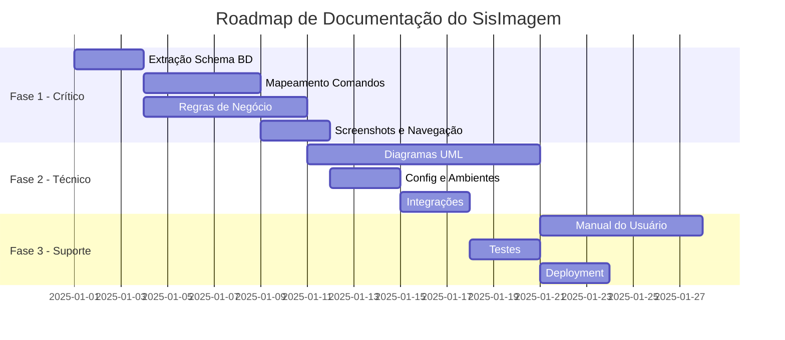
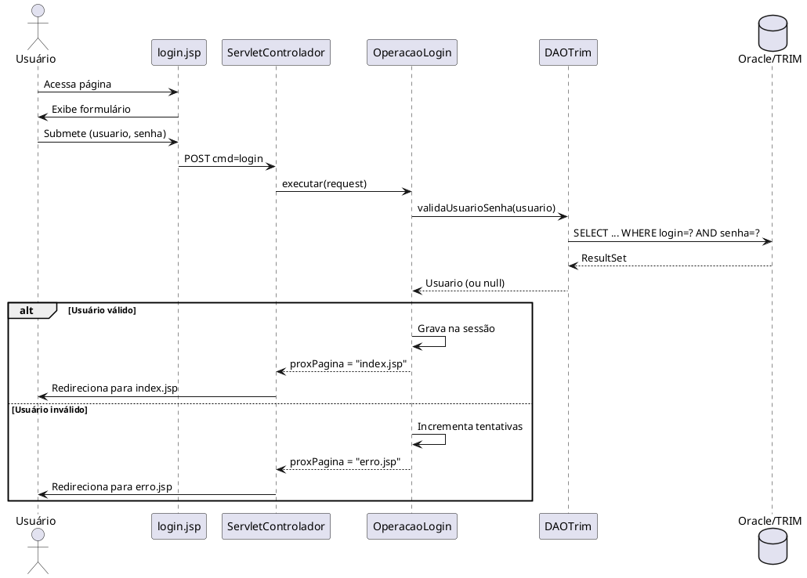

# Plano de Ação: Documentação Completa do SisImagem

## 1. Objetivo

Completar a documentação do SisImagem para viabilizar uma migração/reimplementação com tecnologias modernas, preenchendo as lacunas identificadas em [gaps-documentacao-migracao.md](file:///home/bruna/sisimagem/docs/gaps-documentacao-migracao.md).

---

## 2. Roadmap de Documentação



---

## 3. Fase 1: Documentação Crítica (Semanas 1-3)

### 3.1 Extração do Schema do Banco de Dados (3 dias)

#### Objetivo
Obter o schema completo do Oracle/TRIM com todas as tabelas, colunas, relacionamentos e constraints.

#### Tarefas

**Dia 1: Conexão e Extração Inicial**
```sql
-- 1. Conectar ao banco Oracle/TRIM
-- Usar credenciais do DAOTrim.java (verificar ambiente correto)

-- 2. Listar todas as tabelas do schema
SELECT table_name, num_rows, tablespace_name
FROM user_tables
WHERE table_name LIKE 'TS%'
ORDER BY table_name;

-- 3. Exportar estrutura de cada tabela
SELECT 
    table_name,
    column_name,
    data_type,
    data_length,
    data_precision,
    data_scale,
    nullable,
    column_id
FROM user_tab_columns
WHERE table_name LIKE 'TS%'
ORDER BY table_name, column_id;

-- 4. Exportar constraints
SELECT 
    c.constraint_name,
    c.constraint_type,
    c.table_name,
    cc.column_name,
    c.r_constraint_name,
    c.delete_rule
FROM user_constraints c
LEFT JOIN user_cons_columns cc ON c.constraint_name = cc.constraint_name
WHERE c.table_name LIKE 'TS%'
ORDER BY c.table_name, c.constraint_name;

-- 5. Exportar índices
SELECT 
    i.index_name,
    i.table_name,
    i.uniqueness,
    ic.column_name,
    ic.column_position
FROM user_indexes i
JOIN user_ind_columns ic ON i.index_name = ic.index_name
WHERE i.table_name LIKE 'TS%'
ORDER BY i.table_name, i.index_name, ic.column_position;
```

**Dia 2: Análise de Dados e Relacionamentos**
```sql
-- 1. Analisar dados de exemplo de cada tabela
SELECT * FROM TSRECORD WHERE ROWNUM <= 10;
SELECT * FROM TSEXFIELD WHERE ROWNUM <= 10;
SELECT * FROM TSEXFIELDV WHERE ROWNUM <= 10;
SELECT * FROM TSLOCATION WHERE ROWNUM <= 10;
SELECT * FROM TSJURGROUP WHERE ROWNUM <= 10;
-- Repetir para todas as tabelas TS*

-- 2. Identificar relacionamentos não documentados
-- Analisar colunas que terminam com URI, ID, etc.

-- 3. Verificar sequences
SELECT sequence_name, min_value, max_value, increment_by, last_number
FROM user_sequences;

-- 4. Verificar views
SELECT view_name, text
FROM user_views
WHERE view_name LIKE 'TS%';
```

**Dia 3: Geração de DDL e Diagrama**
```sql
-- 1. Gerar DDL completo
-- Usar ferramenta Oracle SQL Developer ou script PL/SQL
SELECT DBMS_METADATA.GET_DDL('TABLE', table_name) 
FROM user_tables 
WHERE table_name LIKE 'TS%';

-- 2. Criar diagrama ER usando ferramenta (Draw.io, PlantUML, etc.)

-- 3. Documentar em Markdown
```

#### Entregáveis
- [ ] `docs/database/schema-completo.sql` - DDL de todas as tabelas
- [ ] `docs/database/dicionario-dados.md` - Descrição de cada tabela e coluna
- [ ] `docs/database/diagrama-er.png` - Diagrama ER visual
- [ ] `docs/database/diagrama-er.puml` - Diagrama ER em PlantUML (versionável)
- [ ] `docs/database/relacionamentos.md` - Documentação de relacionamentos

---

### 3.2 Mapeamento de Comandos e Fluxos (5 dias)

#### Objetivo
Documentar todos os comandos (`cmd`) do sistema, seus parâmetros, validações e fluxos.

#### Tarefas

**Dia 1-2: Análise de Código**
```bash
# 1. Listar todas as classes Operacao*
find src/main/java/controller -name "Operacao*.java" -type f

# 2. Para cada operação, extrair:
# - Parâmetros recebidos (request.getParameter)
# - Validações realizadas
# - Métodos DAO chamados
# - Página de destino (getProxPagina)
# - Mensagens de erro/sucesso

# 3. Analisar ServletControlador.init() para ver mapeamento cmd -> Operacao
```

**Dia 3-4: Análise de JSPs**
```bash
# 1. Para cada JSP, identificar:
# - Formulários e campos
# - Comandos (cmd) chamados
# - Validações JavaScript
# - Mensagens exibidas

# 2. Mapear fluxo de navegação
# login.jsp -> cmd=login -> index.jsp
# pesquisarDocumento.jsp -> cmd=pesquisarDocumento -> exibiDocumento.jsp
# etc.
```

**Dia 5: Consolidação**
- Criar matriz de comandos completa
- Criar diagramas de navegação
- Documentar parâmetros e validações

#### Entregáveis
- [ ] `docs/comandos/matriz-comandos.md` - Tabela completa de comandos
- [ ] `docs/comandos/fluxos-navegacao.md` - Mapa de navegação
- [ ] `docs/comandos/parametros-validacoes.md` - Detalhamento de cada comando
- [ ] `docs/comandos/diagrama-navegacao.png` - Diagrama visual de navegação

---

### 3.3 Documentação de Regras de Negócio (7 dias)

#### Objetivo
Extrair e documentar todas as regras de negócio embutidas no código.

#### Tarefas

**Dia 1-2: Glossário de Termos**
```markdown
# Criar glossário com termos como:
- PAPEM-41
- PAPEM-42
- Resposta PAPEM-42
- Consignado
- Urgente
- NIP
- RecordId
- RecordNumber
- FullRecordId
- URI
- etc.

# Fontes:
# - Labels em JSPs
# - Comentários no código
# - Entrevistas com usuários-chave
```

**Dia 3-4: Regras de Validação**
```java
// Analisar código para extrair regras:

// 1. Validação de senha (OperacaoLogin, cadastroUsuario.jsp)
// - Tamanho mínimo/máximo
// - Caracteres obrigatórios
// - Senha padrão

// 2. Validação de CPF
// - Formato
// - Dígitos verificadores

// 3. Validação de datas
// - Formatos aceitos
// - Períodos permitidos

// 4. Validação de upload
// - Tamanhos máximos
// - Tipos de arquivo permitidos

// 5. Campos obrigatórios vs opcionais
// - Por tipo de documento
```

**Dia 5-6: Regras de Autorização**
```java
// Analisar:

// 1. Grupos e perfis (TSJURGROUP)
// - Quais grupos existem?
// - Hierarquia

// 2. Permissões
// - Matriz: Grupo x Funcionalidade
// - Quem pode incluir/alterar/excluir

// 3. Bloqueio de usuário
// - Após quantas tentativas?
// - Quanto tempo bloqueado?
// - Como desbloquear?

// 4. Senha padrão e troca forçada
// - Qual é a senha padrão?
// - Quando força troca?
```

**Dia 7: Regras de Cálculo**
```java
// Documentar:

// 1. Geração de RecordId (DAOTrim.buscaProximoRecordId)
// - Lógica de sequencial anual
// - Formato final
// - Tratamento de virada de ano

// 2. Geração de URI (DAOTrim.proximoURI)
// - Algoritmo
// - Formato

// 3. Outras regras de cálculo identificadas
```

#### Entregáveis
- [ ] `docs/negocio/glossario.md` - Glossário de termos
- [ ] `docs/negocio/regras-validacao.md` - Regras de validação
- [ ] `docs/negocio/regras-autorizacao.md` - Regras de autorização
- [ ] `docs/negocio/regras-calculo.md` - Regras de cálculo
- [ ] `docs/negocio/tipos-documento.md` - Tipos de documento e campos

---

### 3.4 Screenshots e Mapeamento de UI (3 dias)

#### Objetivo
Capturar todas as telas do sistema e documentar a interface.

#### Tarefas

**Dia 1: Preparação e Captura**
```bash
# 1. Configurar ambiente de desenvolvimento
# 2. Popular banco com dados de teste
# 3. Iniciar aplicação
# 4. Navegar por todas as telas capturando screenshots

# Telas a capturar:
# - login.jsp
# - index.jsp
# - pesquisarDocumento.jsp
# - exibiDocumento.jsp
# - detalhaDocumento2.jsp
# - incluirDocumento.jsp
# - incluirAnexoPapem41.jsp
# - incluirDocumentoPapem42.jsp
# - incluirDocumentoRespostaPapem42.jsp
# - cadastroUsuario.jsp
# - incluirUsuario.jsp
# - pesquisaUsuario.jsp
# - detalharUsuario.jsp
# - alterarSenha.jsp
# - localizarArquivo.jsp
# - erro.jsp
# - sair.jsp
# - Outras...
```

**Dia 2: Anotação de Screenshots**
```markdown
# Para cada screenshot, documentar:
# - Propósito da tela
# - Campos e seus tipos
# - Botões e ações
# - Validações
# - Mensagens
# - Fluxo de navegação (de onde vem, para onde vai)
```

**Dia 3: Criação de Wireframes**
```
# Criar wireframes simplificados para facilitar redesign
# Usar ferramenta como Figma, Balsamiq, ou Draw.io
# Identificar componentes reutilizáveis
```

#### Entregáveis
- [ ] `docs/ui/screenshots/` - Pasta com todos os screenshots
- [ ] `docs/ui/catalogo-telas.md` - Catálogo de todas as telas
- [ ] `docs/ui/wireframes/` - Wireframes simplificados
- [ ] `docs/ui/componentes.md` - Catálogo de componentes UI

---

## 4. Fase 2: Documentação Técnica (Semanas 4-6)

### 4.1 Diagramas UML (10 dias)

#### Casos de Uso (2 dias)
- [ ] Identificar todos os atores
- [ ] Listar todos os casos de uso
- [ ] Criar diagrama de casos de uso
- [ ] Escrever descrição textual de cada caso de uso

#### Diagramas de Sequência (4 dias)
- [ ] Login e autenticação
- [ ] Pesquisa de documento
- [ ] Inclusão de documento
- [ ] Inclusão de anexo PAPEM-41
- [ ] Inclusão de documento PAPEM-42
- [ ] Inclusão de resposta PAPEM-42
- [ ] Download de documento
- [ ] Escaneamento de documento
- [ ] Cadastro de usuário
- [ ] Alteração de usuário
- [ ] Exclusão de usuário
- [ ] Alteração de senha
- [ ] Bloqueio de usuário
- [ ] Geração de RecordId
- [ ] Encerramento de sessão

#### Diagramas de Atividade (2 dias)
- [ ] Fluxo de autenticação
- [ ] Fluxo de inclusão de documento
- [ ] Fluxo de pesquisa
- [ ] Fluxo de upload de arquivo
- [ ] Fluxo de validação de formulário
- [ ] Fluxo de geração de ID
- [ ] Fluxo de tratamento de erro
- [ ] Fluxo de bloqueio de usuário
- [ ] Fluxo de troca de senha
- [ ] Fluxo de anexação de documento

#### Diagrama de Classes (2 dias)
- [ ] Criar diagrama completo com todos os pacotes
- [ ] Incluir atributos e métodos
- [ ] Documentar relacionamentos

#### Entregáveis
- [ ] `docs/uml/casos-uso.puml` e `.png`
- [ ] `docs/uml/sequencia/*.puml` e `.png`
- [ ] `docs/uml/atividade/*.puml` e `.png`
- [ ] `docs/uml/classes.puml` e `.png`
- [ ] `docs/uml/componentes.puml` e `.png`
- [ ] `docs/uml/implantacao.puml` e `.png`

---

### 4.2 Configurações e Ambientes (3 dias)

#### Dia 1: Variáveis de Ambiente
```properties
# Documentar todas as variáveis necessárias
# Criar arquivo de exemplo .env.example

# Banco de Dados
DB_HOST_PROD=
DB_PORT_PROD=
DB_SID_PROD=
DB_USER_PROD=
DB_PASS_PROD=

DB_HOST_HOMOLOG=
DB_PORT_HOMOLOG=
DB_SID_HOMOLOG=
DB_USER_HOMOLOG=
DB_PASS_HOMOLOG=

# Diretório de Arquivos
FILE_REPOSITORY_PATH=/repositorio/

# Logging
LOG_LEVEL=INFO
LOG_PATH=/var/log/sisimagem/

# Outros
```

#### Dia 2: Configuração de Servidor
```markdown
# Documentar:
# - Versão do WildFly/JBoss
# - Configurações de datasource
# - Configurações de memória
# - Timeout de sessão
# - Configurações de segurança
```

#### Dia 3: Dependências Externas
```markdown
# Documentar:
# - Versão do Oracle Database
# - Driver JDBC
# - MSPSCAN.EXE (onde obter, como instalar)
# - Requisitos de SO
```

#### Entregáveis
- [ ] `docs/config/variaveis-ambiente.md`
- [ ] `docs/config/servidor-aplicacao.md`
- [ ] `docs/config/dependencias-externas.md`
- [ ] `.env.example` - Arquivo de exemplo

---

### 4.3 Integrações (3 dias)

#### Dia 1: Scanner (MSPSCAN.EXE)
```markdown
# Documentar:
# - Como funciona a integração
# - Protocolo de comunicação
# - Formato de dados
# - Tratamento de erros
# - Alternativas modernas
```

#### Dia 2: Sistema de Arquivos
```markdown
# Documentar:
# - Estrutura de diretórios
# - Convenção de nomes
# - Permissões necessárias
# - Estratégia de backup
# - Política de retenção
```

#### Dia 3: Banco de Dados
```markdown
# Documentar:
# - String de conexão
# - Pool de conexões
# - Transações
# - Tratamento de erros
```

#### Entregáveis
- [ ] `docs/integracoes/scanner.md`
- [ ] `docs/integracoes/sistema-arquivos.md`
- [ ] `docs/integracoes/banco-dados.md`

---

## 5. Fase 3: Documentação de Suporte (Semanas 7-9)

### 5.1 Manual do Usuário (7 dias)

#### Estrutura
```markdown
# Manual do Usuário - SisImagem

## 1. Introdução
## 2. Primeiro Acesso
## 3. Login e Autenticação
## 4. Pesquisa de Documentos
## 5. Inclusão de Documentos
## 6. Anexação de Documentos (PAPEM-41)
## 7. Documentos PAPEM-42
## 8. Respostas PAPEM-42
## 9. Download de Documentos
## 10. Escaneamento de Documentos
## 11. Administração de Usuários (Admin)
## 12. Alteração de Senha
## 13. Solução de Problemas Comuns
## 14. FAQs
```

#### Entregáveis
- [ ] `docs/usuario/manual-usuario.md`
- [ ] `docs/usuario/tutorial-primeiro-acesso.md`
- [ ] `docs/usuario/faqs.md`

---

### 5.2 Documentação de Testes (3 dias)

#### Casos de Teste
```markdown
# Para cada funcionalidade:
# - Cenário de teste
# - Pré-condições
# - Passos
# - Resultado esperado
# - Dados de teste
```

#### Entregáveis
- [ ] `docs/testes/casos-teste-funcionais.md`
- [ ] `docs/testes/casos-teste-integracao.md`
- [ ] `docs/testes/casos-teste-seguranca.md`
- [ ] `docs/testes/dados-teste.sql`

---

### 5.3 Documentação de Deployment (3 dias)

#### Guias
- [ ] Guia de instalação
- [ ] Guia de configuração
- [ ] Guia de atualização
- [ ] Guia de backup/restore
- [ ] Troubleshooting

#### Entregáveis
- [ ] `docs/deployment/guia-instalacao.md`
- [ ] `docs/deployment/guia-configuracao.md`
- [ ] `docs/deployment/guia-atualizacao.md`
- [ ] `docs/deployment/guia-backup-restore.md`
- [ ] `docs/deployment/troubleshooting.md`

---

## 6. Estrutura Final de Documentação

```
sisimagem/
├── docs/
│   ├── README.md (índice geral)
│   ├── gaps-documentacao-migracao.md
│   ├── plano-acao-documentacao.md (este arquivo)
│   ├── reverse-engineering-report.md (existente)
│   ├── guia-documentacao-sisimagem.md (existente)
│   │
│   ├── database/
│   │   ├── schema-completo.sql
│   │   ├── dicionario-dados.md
│   │   ├── diagrama-er.png
│   │   ├── diagrama-er.puml
│   │   └── relacionamentos.md
│   │
│   ├── comandos/
│   │   ├── matriz-comandos.md
│   │   ├── fluxos-navegacao.md
│   │   ├── parametros-validacoes.md
│   │   └── diagrama-navegacao.png
│   │
│   ├── negocio/
│   │   ├── glossario.md
│   │   ├── regras-validacao.md
│   │   ├── regras-autorizacao.md
│   │   ├── regras-calculo.md
│   │   └── tipos-documento.md
│   │
│   ├── ui/
│   │   ├── screenshots/
│   │   │   ├── login.png
│   │   │   ├── pesquisar.png
│   │   │   └── ...
│   │   ├── wireframes/
│   │   ├── catalogo-telas.md
│   │   └── componentes.md
│   │
│   ├── uml/
│   │   ├── casos-uso.puml
│   │   ├── casos-uso.png
│   │   ├── sequencia/
│   │   │   ├── login.puml
│   │   │   ├── pesquisa.puml
│   │   │   └── ...
│   │   ├── atividade/
│   │   ├── classes.puml
│   │   ├── classes.png
│   │   ├── componentes.puml
│   │   └── implantacao.puml
│   │
│   ├── config/
│   │   ├── variaveis-ambiente.md
│   │   ├── servidor-aplicacao.md
│   │   └── dependencias-externas.md
│   │
│   ├── integracoes/
│   │   ├── scanner.md
│   │   ├── sistema-arquivos.md
│   │   └── banco-dados.md
│   │
│   ├── usuario/
│   │   ├── manual-usuario.md
│   │   ├── tutorial-primeiro-acesso.md
│   │   └── faqs.md
│   │
│   ├── testes/
│   │   ├── casos-teste-funcionais.md
│   │   ├── casos-teste-integracao.md
│   │   ├── casos-teste-seguranca.md
│   │   └── dados-teste.sql
│   │
│   ├── deployment/
│   │   ├── guia-instalacao.md
│   │   ├── guia-configuracao.md
│   │   ├── guia-atualizacao.md
│   │   ├── guia-backup-restore.md
│   │   └── troubleshooting.md
│   │
│   └── migracao/
│       ├── estrategia-migracao.md
│       ├── mapeamento-tecnologico.md
│       ├── plano-migracao-dados.md
│       └── cronograma.md
│
└── .env.example
```

---

## 7. Ferramentas e Scripts Úteis

### 7.1 Script para Extração de Schema

```bash
#!/bin/bash
# extract-schema.sh

# Configurar conexão
ORACLE_HOST="localhost"
ORACLE_PORT="1521"
ORACLE_SID="TRIM"
ORACLE_USER="usuario"
ORACLE_PASS="senha"

# Conectar e extrair
sqlplus -S ${ORACLE_USER}/${ORACLE_PASS}@${ORACLE_HOST}:${ORACLE_PORT}/${ORACLE_SID} <<EOF
SET PAGESIZE 0
SET FEEDBACK OFF
SET HEADING OFF
SPOOL schema-completo.sql

-- Gerar DDL de todas as tabelas
SELECT DBMS_METADATA.GET_DDL('TABLE', table_name) || ';' 
FROM user_tables 
WHERE table_name LIKE 'TS%'
ORDER BY table_name;

SPOOL OFF
EXIT;
EOF
```

### 7.2 Script para Análise de Comandos

```bash
#!/bin/bash
# analyze-commands.sh

echo "# Matriz de Comandos" > comandos/matriz-comandos.md
echo "" >> comandos/matriz-comandos.md
echo "| Comando | Classe | Arquivo |" >> comandos/matriz-comandos.md
echo "|---------|--------|---------|" >> comandos/matriz-comandos.md

# Extrair comandos do ServletControlador
grep 'mapOperacoes.put' src/main/java/controller/ServletControlador.java | \
  sed 's/.*mapOperacoes.put("\(.*\)", new \(.*\)());/| \1 | \2 | /' | \
  while read line; do
    cmd=$(echo $line | cut -d'|' -f2 | tr -d ' ')
    class=$(echo $line | cut -d'|' -f3 | tr -d ' ')
    file="src/main/java/controller/${class}.java"
    echo "$line $file |" >> comandos/matriz-comandos.md
  done
```

### 7.3 Template PlantUML para Diagramas de Sequência



---

## 8. Checklist de Progresso

### Fase 1: Documentação Crítica
- [ ] Extração do schema do banco (3 dias)
- [ ] Mapeamento de comandos (5 dias)
- [ ] Regras de negócio (7 dias)
- [ ] Screenshots e UI (3 dias)

### Fase 2: Documentação Técnica
- [ ] Diagramas UML (10 dias)
- [ ] Configurações (3 dias)
- [ ] Integrações (3 dias)

### Fase 3: Documentação de Suporte
- [ ] Manual do usuário (7 dias)
- [ ] Testes (3 dias)
- [ ] Deployment (3 dias)

### Total: ~46 dias úteis (~9 semanas)

---

## 9. Próximos Passos Imediatos

1. **Obter acesso ao banco Oracle/TRIM de desenvolvimento**
   - Verificar credenciais em `DAOTrim.java`
   - Testar conexão
   - Executar queries de extração de schema

2. **Configurar ambiente de desenvolvimento**
   - Instalar WildFly/JBoss
   - Fazer deploy da aplicação
   - Popular com dados de teste

3. **Iniciar Fase 1**
   - Começar pela extração do schema
   - Paralelamente, iniciar análise de código para comandos

4. **Definir responsáveis**
   - Quem fará cada parte?
   - Cronograma detalhado
   - Pontos de sincronização

---

## 10. Riscos e Mitigações

| Risco | Impacto | Probabilidade | Mitigação |
|-------|---------|---------------|-----------|
| Falta de acesso ao banco | Alto | Média | Solicitar acesso com antecedência |
| Conhecimento de negócio limitado | Alto | Alta | Agendar entrevistas com usuários-chave |
| Código sem documentação | Médio | Alta | Análise reversa cuidadosa, testes |
| Prazo apertado | Médio | Média | Priorizar documentação crítica |
| Falta de ambiente de teste | Alto | Baixa | Configurar ambiente local |

---

## 11. Conclusão

Este plano de ação fornece um roteiro detalhado para completar a documentação do SisImagem em aproximadamente **9 semanas**. A documentação resultante será suficiente para:

1. ✅ Entender completamente o sistema atual
2. ✅ Planejar uma migração para tecnologias modernas
3. ✅ Treinar novos desenvolvedores
4. ✅ Manter o sistema existente
5. ✅ Reimplementar funcionalidades sem perda

**Recomendação**: Iniciar imediatamente pela **Fase 1**, pois contém as informações mais críticas e que mais tempo levam para obter (especialmente o schema do banco).
